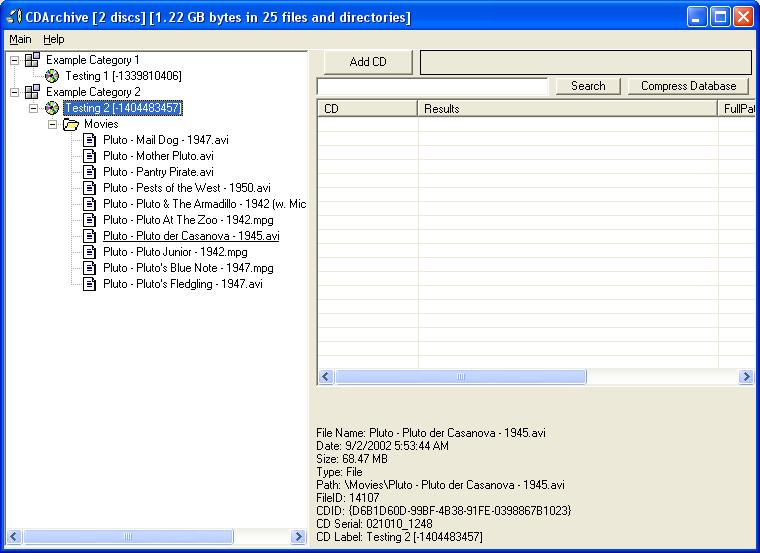



## CD Archiver Version 2

### Description

This is for people who have a lot of cd's full of files they need to keep track of. It is used to catalog all of the files on those cd's and to be easily searchable. It was original written by Elan Hasson. I took Elan's code and cleaned it up a lot. Made it more standard, fixed formating and syntax. Then added to it. It now supports names for each cd, and categories for cd's to be pladed in. Category management is pretty good. If you delete a category it asks you to re-assign the cd's in it to another category, if not delete them (and their files) from the database.
 
### More Info
 

             |
---                |---
**Submitted On**   |2002-11-17 09:23:36
**By**             |[Gregg Housh](https://github.com/Planet-Source-Code/PSCIndex/blob/master/ByAuthor/gregg-housh.md)
**Level**          |Intermediate
**User Rating**    |5.0 (30 globes from 6 users)
**Compatibility**  |VB 5\.0, VB 6\.0
**Category**       |[Complete Applications](https://github.com/Planet-Source-Code/PSCIndex/blob/master/ByCategory/complete-applications__1-27.md)
**World**          |[Visual Basic](https://github.com/Planet-Source-Code/PSCIndex/blob/master/ByWorld/visual-basic.md)
**Archive File**   |[CD\_Archive14989411172002\.zip](https://github.com/Planet-Source-Code/gregg-housh-cd-archiver-version-2__1-40806/archive/master.zip)

